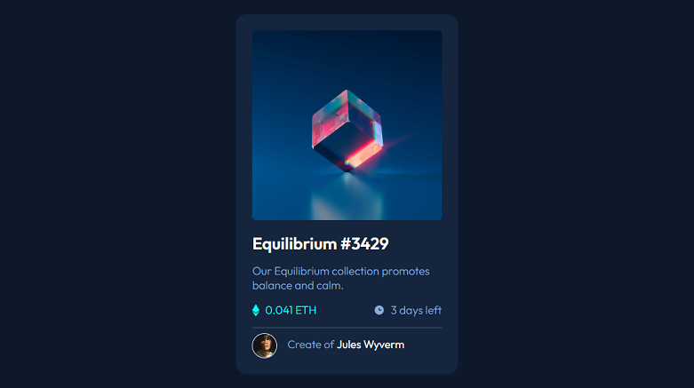
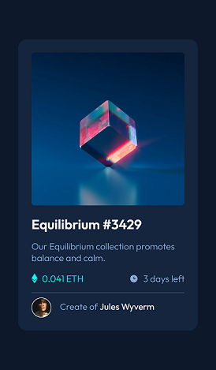

# Frontend Mentor - NFT preview card component solution

This is a solution to the [NFT preview card component challenge on Frontend Mentor](https://www.frontendmentor.io/challenges/nft-preview-card-component-SbdUL_w0U). Frontend Mentor challenges help you improve your coding skills by building realistic projects. 

## Table of contents

- [Overview](#overview)
  - [The challenge](#the-challenge)
  - [Screenshot](#screenshot)
  - [Links](#links)
- [My process](#my-process)
  - [Built with](#built-with)
  - [What I learned](#what-i-learned)
  - [Continued development](#continued-development)
  - [Useful resources](#useful-resources)
- [Author](#author)
- [Acknowledgments](#acknowledgments)

**Note: Delete this note and update the table of contents based on what sections you keep.**

## Overview

### The challenge

Users should be able to:

- View the optimal layout depending on their device's screen size
- See hover states for interactive elements

### Screenshot
Desktop


Mobile



### Links

- Solution URL: [https://github.com/BrayanDaga/NFT-card](https://github.com/BrayanDaga/NFT-card)
- Live Site URL: [https://brayandaga.github.io/NFT-card](https://brayandaga.github.io/NFT-card)

## My process

### Built with

- Semantic HTML5 markup
- CSS custom properties
- Flexbox
- CSS Grid
- Mobile-first workflow


### What I learned


I have learned the use of the "hover" pseudo-class with the "after" pseudo-element
```css
.mask:hover::after {
  background-color: hsla(178, 100%, 50%, 50%);
  ...
}
```

## Author
<!-- - Website - [Add your name here](https://www.your-site.com) -->
- Frontend Mentor - [@BrayanDaga](https://www.frontendmentor.io/profile/BrayanDaga)
- Twitter - [@BrayanDaga](https://www.twitter.com/BrayanDaga)


